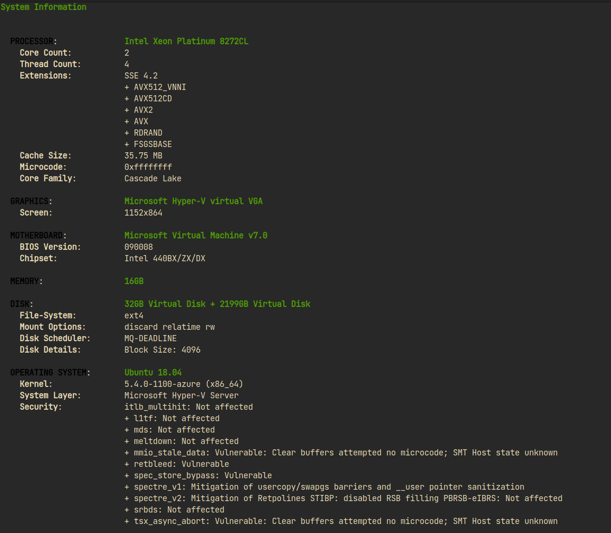
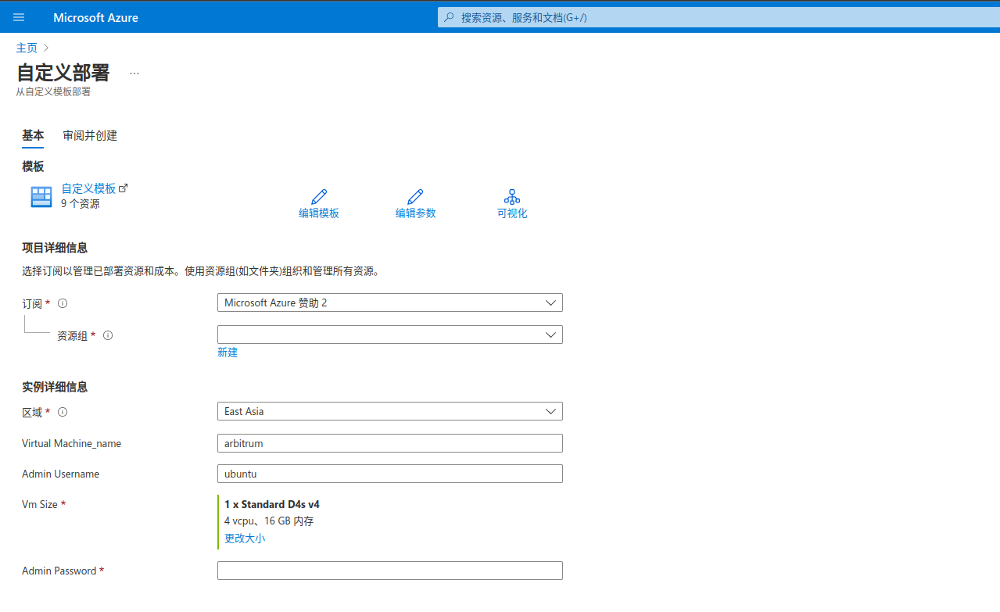
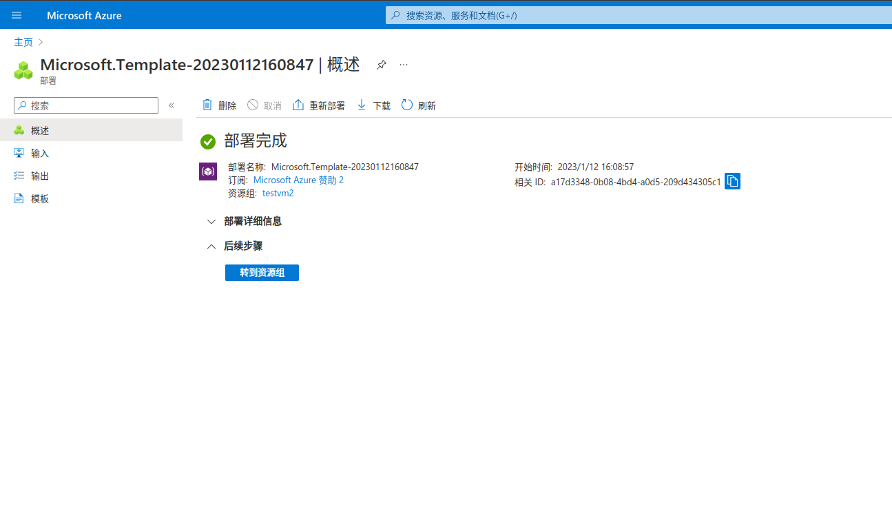
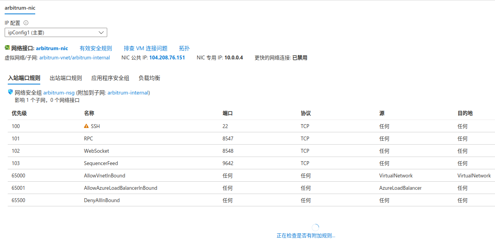
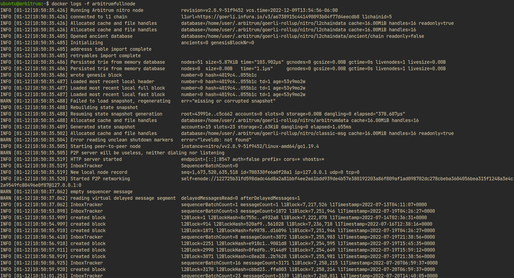

# Arbitrum Fullnode

deploy arbitrum fullnode to azure  

---

## 硬件配置

CPU：4C

内存：8GB

硬盘：1～2TB

## 网络配置

Management：22

PRC：8547

Sequencer Feed：9642

WebSocket：8548

## 环境配置

Linux : ubuntu 18.04 LTS

docker：latest

*参考文档：<https://developer.arbitrum.io/node-running/running-a-node>*

---

# Azure资源

基于以上要求，使用D4s_v4型号的VM，Dv4 系列主要为大多数生产工作负载提供。另外因为Azure的CPU和内存比是1：4，所以优先满足了CPU的要求。

## 环境部署

推荐使用Azure RM Template来部署环境，在部署环境的同时还做了一些小测试，主要是在存储性能方面：  1、Azure FIle Storage(大型文件共享) SMB协议   2、Azure File Storage(高级文件共享) NFS协议 3、Premium SSD(远程数据盘)

最后从性价比上来看，还是推荐SSD的方案，也是本文档主要介绍的方案。模板中除了创建虚拟机之外，还配置网络所需要的端口和docker环境的部署，整个环境部署成功之后，还需要登录虚拟机配置数据磁盘。

以下是三种部署方式的模板，有兴趣的可以自由尝试:

### 使用Azure File Storage (大型文件共享 SMB)

~~~json
{
    "$schema": "https://schema.management.azure.com/schemas/2019-04-01/deploymentTemplate.json#",
    "contentVersion": "1.0.0.0",
    "parameters": {
        "virtualMachine_name": {
            "type": "string",
            "defaultValue": "arbitrum"
        },
        "adminUsername": {
            "type": "string",
            "defaultValue": "ubuntu"
        },
        "vmSize": {
            "type": "string",
            "defaultValue": "Standard_D4s_v4"
        },
        "adminPassword": {
            "type": "securestring"
        }
    },
    "variables": {
        "vnet-name": "[concat(parameters('virtualMachine_name'),'-vnet')]",
        "vnetInterfaces-name": "[concat(parameters('virtualMachine_name'),'-nic')]",
        "vnetPubilcIP-name": "[concat(parameters('virtualMachine_name'),'-external')]",
        "vnetSubnet-name": "[concat(parameters('virtualMachine_name'),'-internal')]",
        "vnetSecurityGroup-name": "[concat(parameters('virtualMachine_name'),'-nsg')]",
        "StorageAccount-name": "[concat(parameters('virtualMachine_name'),uniqueString(resourceGroup().id))]",
        "FileShare-name": "[concat(parameters('virtualMachine_name'),'fileshare')]",
        "location": "[resourceGroup().location]"
    },
    "resources": [
        {
            "type": "Microsoft.Storage/storageAccounts",
            "name": "[variables('StorageAccount-name')]",
            "apiVersion": "2021-04-01",
            "location": "[variables('location')]",
            "tags": {
                "displayName": "ubuntuVM1 Storage Account"
            },
            "sku": {
                "name": "Standard_LRS"
            },
            "kind": "StorageV2",
            "properties": {
                "largeFileSharesState": "Enabled"
            }
        },
        {
            "type": "Microsoft.Storage/storageAccounts/fileServices/shares",
            "apiVersion": "2021-04-01",
            "name": "[format('{0}/default/{1}', variables('StorageAccount-name'), variables('FileShare-name'))]",
            "properties": {
                "shareQuota": 2048
            },
            "dependsOn": [
                "[resourceId('Microsoft.Storage/storageAccounts', variables('StorageAccount-name'))]"
            ]
        },
        {
            "type": "Microsoft.Network/publicIPAddresses",
            "name": "[variables('vnetPubilcIP-name')]",
            "apiVersion": "2020-11-01",
            "location": "[variables('location')]",
            "tags": {
                "displayName": "PublicIPAddress"
            },
            "properties": {
                "publicIPAllocationMethod": "Static",
                "dnsSettings": {
                    "domainNameLabel": "[concat(toLower('ubuntuVM1'),uniqueString(resourceGroup().id))]"
                }
            }
        },
        {
            "type": "Microsoft.Network/networkSecurityGroups",
            "name": "[variables('vnetSecurityGroup-name')]",
            "apiVersion": "2020-11-01",
            "location": "[variables('location')]",
            "properties": {
                "securityRules": [
                    {
                        "name": "SSH",
                        "properties": {
                            "description": "description",
                            "protocol": "Tcp",
                            "sourcePortRange": "*",
                            "destinationPortRange": "22",
                            "sourceAddressPrefix": "*",
                            "destinationAddressPrefix": "*",
                            "access": "Allow",
                            "priority": 100,
                            "direction": "Inbound"
                        }
                    },
                    {
                        "name": "RPC",
                        "properties": {
                            "description": "description",
                            "protocol": "Tcp",
                            "sourcePortRange": "*",
                            "destinationPortRange": "8547",
                            "sourceAddressPrefix": "*",
                            "destinationAddressPrefix": "*",
                            "access": "Allow",
                            "priority": 101,
                            "direction": "Inbound"
                        }
                    },
                    {
                        "name": "WebSocket",
                        "properties": {
                            "description": "description",
                            "protocol": "Tcp",
                            "sourcePortRange": "*",
                            "destinationPortRange": "8548",
                            "sourceAddressPrefix": "*",
                            "destinationAddressPrefix": "*",
                            "access": "Allow",
                            "priority": 102,
                            "direction": "Inbound"
                        }
                    },
                    {
                        "name": "SequencerFeed",
                        "properties": {
                            "description": "description",
                            "protocol": "Tcp",
                            "sourcePortRange": "*",
                            "destinationPortRange": "9642",
                            "sourceAddressPrefix": "*",
                            "destinationAddressPrefix": "*",
                            "access": "Allow",
                            "priority": 103,
                            "direction": "Inbound"
                        }
                    }
                ]
            }
        },
        {
            "type": "Microsoft.Network/virtualNetworks",
            "name": "[variables('vnet-name')]",
            "apiVersion": "2020-11-01",
            "location": "[variables('location')]",
            "dependsOn": [
                "[resourceId('Microsoft.Network/networkSecurityGroups', variables('vnetSecurityGroup-name'))]"
            ],
            "tags": {
                "displayName": "ubuntuVM1-VirtualNetwork"
            },
            "properties": {
                "addressSpace": {
                    "addressPrefixes": [
                        "10.0.0.0/16"
                    ]
                },
                "subnets": [
                    {
                        "name": "[variables('vnetSubnet-name')]",
                        "properties": {
                            "addressPrefix": "10.0.0.0/24",
                            "networkSecurityGroup": {
                                "id": "[resourceId('Microsoft.Network/networkSecurityGroups', variables('vnetSecurityGroup-name'))]"
                            }
                        }
                    }
                ]
            }
        },
        {
            "type": "Microsoft.Network/networkInterfaces",
            "name": "[variables('vnetInterfaces-name')]",
            "apiVersion": "2020-11-01",
            "location": "[variables('location')]",
            "dependsOn": [
                "[resourceId('Microsoft.Network/publicIPAddresses', variables('vnetPubilcIP-name'))]",
                "[resourceId('Microsoft.Network/virtualNetworks', variables('vnet-name'))]"
            ],
            "tags": {
                "displayName": "ubuntuVM1-NetworkInterface"
            },
            "properties": {
                "ipConfigurations": [
                    {
                        "name": "ipConfig1",
                        "properties": {
                            "privateIPAllocationMethod": "Dynamic",
                            "publicIPAddress": {
                                "id": "[resourceId('Microsoft.Network/publicIPAddresses', variables('vnetPubilcIP-name'))]"
                            },
                            "subnet": {
                                "id": "[resourceId('Microsoft.Network/virtualNetworks/subnets', variables('vnet-name'), variables('vnetSubnet-name'))]"
                            }
                        }
                    }
                ]
            }
        },
        {
            "name": "[parameters('virtualMachine_name')]",
            "type": "Microsoft.Compute/virtualMachines",
            "apiVersion": "2021-03-01",
            "location": "[variables('location')]",
            "dependsOn": [
                "[resourceId('Microsoft.Network/networkInterfaces', variables('vnetInterfaces-name'))]"
            ],
            "tags": {
                "displayName": "ubuntuVM1"
            },
            "properties": {
                "hardwareProfile": {
                    "vmSize": "[parameters('vmSize')]"
                },
                "osProfile": {
                    "computerName": "[parameters('virtualMachine_name')]",
                    "adminUsername": "[parameters('adminUsername')]",
                    "adminPassword": "[parameters('adminPassword')]"
                },
                "storageProfile": {
                    "imageReference": {
                        "publisher": "Canonical",
                        "offer": "UbuntuServer",
                        "sku": "18.04-LTS",
                        "version": "latest"
                    },
                    "osDisk": {
                        "name": "ubuntuVM1-OSDisk",
                        "caching": "ReadWrite",
                        "createOption": "FromImage"
                    }
                },
                "networkProfile": {
                    "networkInterfaces": [
                        {
                            "id": "[resourceId('Microsoft.Network/networkInterfaces', variables('vnetInterfaces-name'))]"
                        }
                    ]
                }
            }
        },
        {
            "type": "Microsoft.Compute/virtualMachines/extensions",
            "name": "[concat(parameters('virtualMachine_name'),'/installDocker')]",
            "apiVersion": "2021-11-01",
            "location": "[variables('location')]",
            "dependsOn": [
                "[concat('Microsoft.Compute/virtualMachines/', parameters('virtualMachine_name'))]"
            ],
            "properties": {
                "publisher": "Microsoft.Azure.Extensions",
                "type": "CustomScript",
                "typeHandlerVersion": "2.1",
                "autoUpgradeMinorVersion": true,
                "settings": {
                },
                "protectedSettings": {
                    "commandToExecute": "sh install.sh",
                    "fileUris": ["https://raw.githubusercontent.com/zhengyiqun/AzureTemplateDemo/main/script/install.sh"]
                }
            }
        }
    ]
}
~~~

### 使用Azure File Storage (高级文件共享 NFS)

~~~json
{
    "$schema": "https://schema.management.azure.com/schemas/2019-04-01/deploymentTemplate.json#",
    "contentVersion": "1.0.0.0",
    "parameters": {
        "virtualMachine_name": {
            "type": "string",
            "defaultValue": "arbitrum"
        },
        "adminUsername": {
            "type": "string",
            "defaultValue": "ubuntu"
        },
        "vmSize": {
            "type": "string",
            "defaultValue": "Standard_D4s_v4"
        },
        "adminPassword": {
            "type": "securestring"
        }
    },
    "variables": {
        "vnet-name": "[concat(parameters('virtualMachine_name'),'-vnet')]",
        "vnetInterfaces-name": "[concat(parameters('virtualMachine_name'),'-nic')]",
        "vnetPubilcIP-name": "[concat(parameters('virtualMachine_name'),'-external')]",
        "vnetSubnet-name": "[concat(parameters('virtualMachine_name'),'-internal')]",
        "vnetSecurityGroup-name": "[concat(parameters('virtualMachine_name'),'-nsg')]",
        "StorageAccount-name": "[concat(parameters('virtualMachine_name'),uniqueString(resourceGroup().id))]",
        "FileShare-name": "[concat(parameters('virtualMachine_name'),'fileshare')]",
        "location": "[resourceGroup().location]"
    },
    "resources": [
        {
            "type": "Microsoft.Storage/storageAccounts",
            "name": "[variables('StorageAccount-name')]",
            "apiVersion": "2021-04-01",
            "location": "[variables('location')]",
            "tags": {
                "displayName": "ubuntuVM1 Storage Account"
            },
            "sku": {
                "name": "Premium_LRS"
            },
            "kind": "FileStorage",
            "properties": {
                "largeFileSharesState": "Enabled"
            }
        },
        {
            "type": "Microsoft.Storage/storageAccounts/fileServices/shares",
            "apiVersion": "2021-04-01",
            "name": "[format('{0}/default/{1}', variables('StorageAccount-name'), variables('FileShare-name'))]",
            "properties": {
                "enabledProtocols": "NFS",
                "rootSquash": "NoRootSquash",
                "shareQuota": 2048
            },
            "dependsOn": [
                "[resourceId('Microsoft.Storage/storageAccounts', variables('StorageAccount-name'))]"
            ]
        },
        {
            "type": "Microsoft.Network/publicIPAddresses",
            "name": "[variables('vnetPubilcIP-name')]",
            "apiVersion": "2020-11-01",
            "location": "[variables('location')]",
            "tags": {
                "displayName": "PublicIPAddress"
            },
            "properties": {
                "publicIPAllocationMethod": "Static",
                "dnsSettings": {
                    "domainNameLabel": "[concat(toLower('ubuntuVM1'),uniqueString(resourceGroup().id))]"
                }
            }
        },
        {
            "type": "Microsoft.Network/networkSecurityGroups",
            "name": "[variables('vnetSecurityGroup-name')]",
            "apiVersion": "2020-11-01",
            "location": "[variables('location')]",
            "properties": {
                "securityRules": [
                    {
                        "name": "SSH",
                        "properties": {
                            "description": "description",
                            "protocol": "Tcp",
                            "sourcePortRange": "*",
                            "destinationPortRange": "22",
                            "sourceAddressPrefix": "*",
                            "destinationAddressPrefix": "*",
                            "access": "Allow",
                            "priority": 100,
                            "direction": "Inbound"
                        }
                    },
                    {
                        "name": "RPC",
                        "properties": {
                            "description": "description",
                            "protocol": "Tcp",
                            "sourcePortRange": "*",
                            "destinationPortRange": "8547",
                            "sourceAddressPrefix": "*",
                            "destinationAddressPrefix": "*",
                            "access": "Allow",
                            "priority": 101,
                            "direction": "Inbound"
                        }
                    },
                    {
                        "name": "WebSocket",
                        "properties": {
                            "description": "description",
                            "protocol": "Tcp",
                            "sourcePortRange": "*",
                            "destinationPortRange": "8548",
                            "sourceAddressPrefix": "*",
                            "destinationAddressPrefix": "*",
                            "access": "Allow",
                            "priority": 102,
                            "direction": "Inbound"
                        }
                    },
                    {
                        "name": "SequencerFeed",
                        "properties": {
                            "description": "description",
                            "protocol": "Tcp",
                            "sourcePortRange": "*",
                            "destinationPortRange": "9642",
                            "sourceAddressPrefix": "*",
                            "destinationAddressPrefix": "*",
                            "access": "Allow",
                            "priority": 103,
                            "direction": "Inbound"
                        }
                    }
                ]
            }
        },
        {
            "type": "Microsoft.Network/virtualNetworks",
            "name": "[variables('vnet-name')]",
            "apiVersion": "2020-11-01",
            "location": "[variables('location')]",
            "dependsOn": [
                "[resourceId('Microsoft.Network/networkSecurityGroups', variables('vnetSecurityGroup-name'))]"
            ],
            "tags": {
                "displayName": "ubuntuVM1-VirtualNetwork"
            },
            "properties": {
                "addressSpace": {
                    "addressPrefixes": [
                        "10.0.0.0/16"
                    ]
                },
                "subnets": [
                    {
                        "name": "[variables('vnetSubnet-name')]",
                        "properties": {
                            "addressPrefix": "10.0.0.0/24",
                            "networkSecurityGroup": {
                                "id": "[resourceId('Microsoft.Network/networkSecurityGroups', variables('vnetSecurityGroup-name'))]"
                            }
                        }
                    }
                ]
            }
        },
        {
            "type": "Microsoft.Network/networkInterfaces",
            "name": "[variables('vnetInterfaces-name')]",
            "apiVersion": "2020-11-01",
            "location": "[variables('location')]",
            "dependsOn": [
                "[resourceId('Microsoft.Network/publicIPAddresses', variables('vnetPubilcIP-name'))]",
                "[resourceId('Microsoft.Network/virtualNetworks', variables('vnet-name'))]"
            ],
            "tags": {
                "displayName": "ubuntuVM1-NetworkInterface"
            },
            "properties": {
                "ipConfigurations": [
                    {
                        "name": "ipConfig1",
                        "properties": {
                            "privateIPAllocationMethod": "Dynamic",
                            "publicIPAddress": {
                                "id": "[resourceId('Microsoft.Network/publicIPAddresses', variables('vnetPubilcIP-name'))]"
                            },
                            "subnet": {
                                "id": "[resourceId('Microsoft.Network/virtualNetworks/subnets', variables('vnet-name'), variables('vnetSubnet-name'))]"
                            }
                        }
                    }
                ]
            }
        }
        {
            "name": "[parameters('virtualMachine_name')]",
            "type": "Microsoft.Compute/virtualMachines",
            "apiVersion": "2021-03-01",
            "location": "[variables('location')]",
            "dependsOn": [
                "[resourceId('Microsoft.Network/networkInterfaces', variables('vnetInterfaces-name'))]"
            ],
            "tags": {
                "displayName": "ubuntuVM1"
            },
            "properties": {
                "hardwareProfile": {
                    "vmSize": "[parameters('vmSize')]"
                },
                "osProfile": {
                    "computerName": "[parameters('virtualMachine_name')]",
                    "adminUsername": "[parameters('adminUsername')]",
                    "adminPassword": "[parameters('adminPassword')]"
                },
                "storageProfile": {
                    "imageReference": {
                        "publisher": "Canonical",
                        "offer": "UbuntuServer",
                        "sku": "18.04-LTS",
                        "version": "latest"
                    },
                    "osDisk": {
                        "name": "ubuntuVM1-OSDisk",
                        "caching": "ReadWrite",
                        "createOption": "FromImage"
                    }
                },
                "networkProfile": {
                    "networkInterfaces": [
                        {
                            "id": "[resourceId('Microsoft.Network/networkInterfaces', variables('vnetInterfaces-name'))]"
                        }
                    ]
                }
            }
        },
        {
            "type": "Microsoft.Compute/virtualMachines/extensions",
            "name": "[concat(parameters('virtualMachine_name'),'/installDocker')]",
            "apiVersion": "2021-11-01",
            "location": "[variables('location')]",
            "dependsOn": [
                "[concat('Microsoft.Compute/virtualMachines/', parameters('virtualMachine_name'))]"
            ],
            "properties": {
                "publisher": "Microsoft.Azure.Extensions",
                "type": "CustomScript",
                "typeHandlerVersion": "2.1",
                "autoUpgradeMinorVersion": true,
                "settings": {
                },
                "protectedSettings": {
                    "commandToExecute": "sh install.sh",
                    "fileUris": ["https://raw.githubusercontent.com/zhengyiqun/AzureTemplateDemo/main/script/install.sh"]
                }
            }
        }
    ]
}
~~~

### 使用Azure Managed Disk (Premium SSD P40)

~~~json
{
    "$schema": "https://schema.management.azure.com/schemas/2019-04-01/deploymentTemplate.json#",
    "contentVersion": "1.0.0.0",
    "parameters": {
        "virtualMachine_name": {
            "type": "string",
            "defaultValue": "arbitrum"
        },
        "adminUsername": {
            "type": "string",
            "defaultValue": "ubuntu"
        },
        "vmSize": {
            "type": "string",
            "defaultValue": "Standard_D4s_v4"
        },
        "adminPassword": {
            "type": "securestring"
        }
    },
    "variables": {
        "vnet-name": "[concat(parameters('virtualMachine_name'),'-vnet')]",
        "vnetInterfaces-name": "[concat(parameters('virtualMachine_name'),'-nic')]",
        "vnetPubilcIP-name": "[concat(parameters('virtualMachine_name'),'-external')]",
        "vnetSubnet-name": "[concat(parameters('virtualMachine_name'),'-internal')]",
        "vnetSecurityGroup-name": "[concat(parameters('virtualMachine_name'),'-nsg')]",
        "Datadisk-name": "[concat(parameters('virtualMachine_name'),'-datadisk1')]",
        "location": "[resourceGroup().location]"
    },
    "resources": [
        {
            "type": "Microsoft.Network/publicIPAddresses",
            "name": "[variables('vnetPubilcIP-name')]",
            "apiVersion": "2020-11-01",
            "location": "[variables('location')]",
            "tags": {
                "displayName": "PublicIPAddress"
            },
            "properties": {
                "publicIPAllocationMethod": "Static",
                "dnsSettings": {
                    "domainNameLabel": "[concat(toLower('ubuntuVM1'),uniqueString(resourceGroup().id))]"
                }
            }
        },
        {
            "type": "Microsoft.Network/networkSecurityGroups",
            "name": "[variables('vnetSecurityGroup-name')]",
            "apiVersion": "2020-11-01",
            "location": "[variables('location')]",
            "properties": {
                "securityRules": [
                    {
                        "name": "SSH",
                        "properties": {
                            "description": "description",
                            "protocol": "Tcp",
                            "sourcePortRange": "*",
                            "destinationPortRange": "22",
                            "sourceAddressPrefix": "*",
                            "destinationAddressPrefix": "*",
                            "access": "Allow",
                            "priority": 100,
                            "direction": "Inbound"
                        }
                    },
                    {
                        "name": "RPC",
                        "properties": {
                            "description": "description",
                            "protocol": "Tcp",
                            "sourcePortRange": "*",
                            "destinationPortRange": "8547",
                            "sourceAddressPrefix": "*",
                            "destinationAddressPrefix": "*",
                            "access": "Allow",
                            "priority": 101,
                            "direction": "Inbound"
                        }
                    },
                    {
                        "name": "WebSocket",
                        "properties": {
                            "description": "description",
                            "protocol": "Tcp",
                            "sourcePortRange": "*",
                            "destinationPortRange": "8548",
                            "sourceAddressPrefix": "*",
                            "destinationAddressPrefix": "*",
                            "access": "Allow",
                            "priority": 102,
                            "direction": "Inbound"
                        }
                    },
                    {
                        "name": "SequencerFeed",
                        "properties": {
                            "description": "description",
                            "protocol": "Tcp",
                            "sourcePortRange": "*",
                            "destinationPortRange": "9642",
                            "sourceAddressPrefix": "*",
                            "destinationAddressPrefix": "*",
                            "access": "Allow",
                            "priority": 103,
                            "direction": "Inbound"
                        }
                    }
                ]
            }
        },
        {
            "type": "Microsoft.Network/virtualNetworks",
            "name": "[variables('vnet-name')]",
            "apiVersion": "2020-11-01",
            "location": "[variables('location')]",
            "dependsOn": [
                "[resourceId('Microsoft.Network/networkSecurityGroups', variables('vnetSecurityGroup-name'))]"
            ],
            "tags": {
                "displayName": "ubuntuVM1-VirtualNetwork"
            },
            "properties": {
                "addressSpace": {
                    "addressPrefixes": [
                        "10.0.0.0/16"
                    ]
                },
                "subnets": [
                    {
                        "name": "[variables('vnetSubnet-name')]",
                        "properties": {
                            "addressPrefix": "10.0.0.0/24",
                            "networkSecurityGroup": {
                                "id": "[resourceId('Microsoft.Network/networkSecurityGroups', variables('vnetSecurityGroup-name'))]"
                            }
                        }
                    }
                ]
            }
        },
        {
            "type": "Microsoft.Network/networkInterfaces",
            "name": "[variables('vnetInterfaces-name')]",
            "apiVersion": "2020-11-01",
            "location": "[variables('location')]",
            "dependsOn": [
                "[resourceId('Microsoft.Network/publicIPAddresses', variables('vnetPubilcIP-name'))]",
                "[resourceId('Microsoft.Network/virtualNetworks', variables('vnet-name'))]"
            ],
            "tags": {
                "displayName": "ubuntuVM1-NetworkInterface"
            },
            "properties": {
                "ipConfigurations": [
                    {
                        "name": "ipConfig1",
                        "properties": {
                            "privateIPAllocationMethod": "Dynamic",
                            "publicIPAddress": {
                                "id": "[resourceId('Microsoft.Network/publicIPAddresses', variables('vnetPubilcIP-name'))]"
                            },
                            "subnet": {
                                "id": "[resourceId('Microsoft.Network/virtualNetworks/subnets', variables('vnet-name'), variables('vnetSubnet-name'))]"
                            }
                        }
                    }
                ]
            }
        },
        {
            "type": "Microsoft.Compute/disks",
            "apiVersion": "2022-03-02",
            "name": "[variables('Datadisk-name')]",
            "location": "[resourceGroup().location]",
            "sku": {
                "name": "Premium_LRS"
            },
            "properties": {
                "creationData": {
                    "createOption": "Empty"
                },
                "diskSizeGB": 2048,
                "tier": "P40"
            }
        },
        {
            "name": "[parameters('virtualMachine_name')]",
            "type": "Microsoft.Compute/virtualMachines",
            "apiVersion": "2021-03-01",
            "location": "[variables('location')]",
            "dependsOn": [
                "[resourceId('Microsoft.Network/networkInterfaces', variables('vnetInterfaces-name'))]"
            ],
            "tags": {
                "displayName": "ubuntuVM1"
            },
            "properties": {
                "hardwareProfile": {
                    "vmSize": "[parameters('vmSize')]"
                },
                "osProfile": {
                    "computerName": "[parameters('virtualMachine_name')]",
                    "adminUsername": "[parameters('adminUsername')]",
                    "adminPassword": "[parameters('adminPassword')]"
                },
                "storageProfile": {
                    "imageReference": {
                        "publisher": "Canonical",
                        "offer": "UbuntuServer",
                        "sku": "18.04-LTS",
                        "version": "latest"
                    },
                    "osDisk": {
                        "name": "ubuntuVM1-OSDisk",
                        "caching": "ReadWrite",
                        "createOption": "FromImage"
                    },
                    "dataDisks": [
                        {
                            "name": "[variables('Datadisk-name')]",
                            "lun": 0,
                            "createOption": "attach",
                            "managedDisk": {
                                "id": "[resourceId('Microsoft.Compute/disks/', variables('Datadisk-name'))]"
                            }
                        }
                    ]
                },
                "networkProfile": {
                    "networkInterfaces": [
                        {
                            "id": "[resourceId('Microsoft.Network/networkInterfaces', variables('vnetInterfaces-name'))]"
                        }
                    ]
                }
            }
        },
        {
            "type": "Microsoft.Compute/virtualMachines/extensions",
            "name": "[concat(parameters('virtualMachine_name'),'/installDocker')]",
            "apiVersion": "2021-11-01",
            "location": "[variables('location')]",
            "dependsOn": [
                "[concat('Microsoft.Compute/virtualMachines/', parameters('virtualMachine_name'))]"
            ],
            "properties": {
                "publisher": "Microsoft.Azure.Extensions",
                "type": "CustomScript",
                "typeHandlerVersion": "2.1",
                "autoUpgradeMinorVersion": true,
                "settings": {
                },
                "protectedSettings": {
                    "commandToExecute": "sh install.sh",
                    "fileUris": ["https://raw.githubusercontent.com/zhengyiqun/AzureTemplateDemo/main/script/install.sh"]
                }
            }
        }
    ]
}
~~~

## 环境配置

点击`Deploy to Azure` 按钮，登录到你的Azure订阅就可以看到这个界面，只需要新建一个资源组，并设置管理员密码，其他保持默认即可。

当看到这个页面就说明已经部署成功了，转到资源组查看虚拟机网络配置

可以看到模板中的端口号已经配置好了，找到并记录公网IP地址

通过`ssh` 命令登录虚拟机，输入之前创建虚拟机时设置的管理员密码

~~~bash
ssh ubuntu@104.208.76.151
~~~

查看docker是否安装成功

~~~bash
docker version

Client: Docker Engine - Community
 Version:           20.10.22
 API version:       1.41
 Go version:        go1.18.9
 Git commit:        3a2c30b
 Built:             Thu Dec 15 22:28:02 2022
 OS/Arch:           linux/amd64
 Context:           default
 Experimental:      true

Server: Docker Engine - Community
 Engine:
  Version:          20.10.22
  API version:      1.41 (minimum version 1.12)
  Go version:       go1.18.9
  Git commit:       42c8b31
  Built:            Thu Dec 15 22:25:51 2022
  OS/Arch:          linux/amd64
  Experimental:     false
 containerd:
  Version:          1.6.15
  GitCommit:        5b842e528e99d4d4c1686467debf2bd4b88ecd86
 runc:
  Version:          1.1.4
  GitCommit:        v1.1.4-0-g5fd4c4d
 docker-init:
  Version:          0.19.0
  GitCommit:        de40ad0
~~~

查看数据盘是否存在，可以看到有块2T的数据盘`/dev/sdb`

~~~bash
sudo fdisk -l

Disk /dev/sda: 30 GiB, 32213303296 bytes, 62916608 sectors
Units: sectors of 1 * 512 = 512 bytes
Sector size (logical/physical): 512 bytes / 4096 bytes
I/O size (minimum/optimal): 4096 bytes / 4096 bytes
Disklabel type: gpt
Disk identifier: F043A51F-6BA7-40B6-A097-C28DE973DE9B

Device      Start      End  Sectors  Size Type
/dev/sda1  227328 62916574 62689247 29.9G Linux filesystem
/dev/sda14   2048    10239     8192    4M BIOS boot
/dev/sda15  10240   227327   217088  106M EFI System

Partition table entries are not in disk order.

Disk /dev/sdb: 2 TiB, 2199023255552 bytes, 4294967296 sectors
Units: sectors of 1 * 512 = 512 bytes
Sector size (logical/physical): 512 bytes / 4096 bytes
I/O size (minimum/optimal): 4096 bytes / 4096 bytes
~~~

新建一个目录，mount到数据盘并修改权限

~~~bash
#格式化磁盘
sudo mkfs.ext4 /dev/sdb

#查看磁盘的UUID
blkid -s UUID

/dev/sda1: UUID="b2fc75a0-1b27-4b2e-bfbd-84236b0f49ee"
/dev/sda15: UUID="9AF4-112D"
/dev/sdb: UUID="3a754e30-ca3f-4bad-8a99-5d243d2f377c"

#新建目录并挂载磁盘
sudo mkdir -p /mount/datadisk
sudo mount /dev/sdb /mount/datadisk

#查看磁盘是否挂载成功
df -h

Filesystem      Size  Used Avail Use% Mounted on
udev            7.8G     0  7.8G   0% /dev
tmpfs           1.6G  712K  1.6G   1% /run
/dev/sda1        29G  2.2G   27G   8% /
tmpfs           7.9G     0  7.9G   0% /dev/shm
tmpfs           5.0M     0  5.0M   0% /run/lock
tmpfs           7.9G     0  7.9G   0% /sys/fs/cgroup
/dev/sda15      105M  4.4M  100M   5% /boot/efi
tmpfs           1.6G     0  1.6G   0% /run/user/1000
/dev/sdb        2.0T   28K  1.9T   1% /mount/datadisk

#写入到fstab:UUID=3a754e30-ca3f-4bad-8a99-5d243d2f377c /mount/datadisk ext4 defaults 1 1  
sudo vim /etc/fstab

#修改目录权限
sudo chmod +666 /mount/datadisk

#重启
sudo reboot
~~~

## 部署Arbitrum Fullnode

使用docker image启动Arbitrum fullnode，根据[文档](https://developer.arbitrum.io/node-running/running-a-node#required-parameter)还需准备2个参数，` L1 node RPC endpoint` 和 ` L2 Chain Id`，这两个参数可以在[Public Chains](https://developer.arbitrum.io/public-chains)中找到，测试环境使用`Nitro Goerli Rollup Testnet`。从文档上看Testnet支持[Infura](https://infura.io/)，所以我使用了自己的链接，各位部署的时候要换成自己的PROJECTID：

~~~bash
docker run --name arbitrumfullnode -idt  -v /mount/datadisk:/home/user/.arbitrum -p 0.0.0.0:8547:8547 -p 0.0.0.0:8548:8548 offchainlabs/nitro-node:v2.0.10-rc.2-9148773 --l1.url https://goerli.infura.io/v3/YOUR-PROJECT-ID --l2.chain-id=421613 --http.api=net,web3,eth,debug --http.corsdomain=* --http.addr=0.0.0.0 --http.vhosts=*
~~~

此外还需要有两点注意：
- 如果选择正式网，需要创始数据库的快照，因此还需要再加一个参数`--init.url`，详细信息可以查看[文档](https://developer.arbitrum.io/node-running/running-a-node#required-artifacts)
- 当节点更新时可以复用此命令，但是对于docker container的版本需要更新（有些升级因为涉及共识升级，所以是强制更新）

查看镜像运行情况

~~~bash
docker logs -f arbitrumfullnode
~~~

可以看到已经开始同步了
